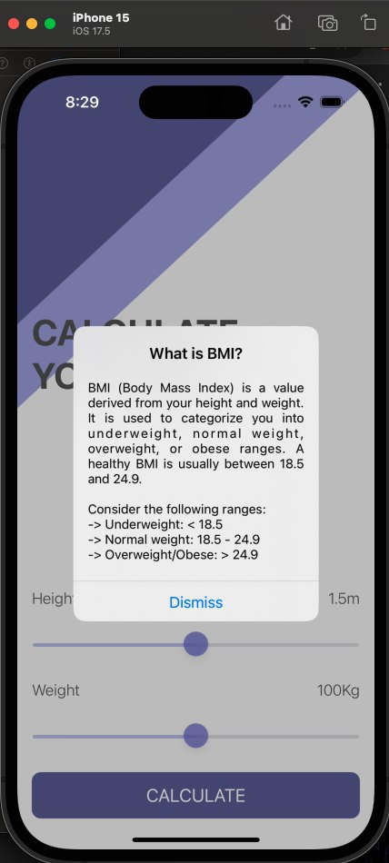

<h1 align="center">BMI Calculator - iOS App</h1>

**BMI Calculator** is a simple and useful app that calculates your Body Mass Index (BMI) based on your weight and height. It provides helpful health advice depending on whether you need to eat more pies or have already eaten too many! The app is designed to make BMI calculations simple and fun.

## Features:

- **BMI Calculation**: Calculate your Body Mass Index based on weight and height.
- **Health Advice**: Get health recommendations based on your BMI results.
- **Interactive UI**: A simple and clean design that makes using the app easy for anyone.
- **Real-Time Feedback**: Get instant feedback about your BMI and health status after entering your details.

## Installation:

To run this project locally:

1. Clone the repository:
    ```bash
    git clone https://github.com/deepanshubajaj/BMI-Calculator-iOSApp.git
    ```

2. Open the project in Xcode:
    ```bash
    open BMI Calculator.xcodeproj
    ```

3. Build and run the app on a simulator or physical device.

> Make sure you have Xcode installed and configured properly to run the project.

## App Look:

<p align="center">
  
</p>
<p align="center">
  *App snapshot in the simulator.*
</p>

## Screenshots:

<p align="center">
  
</p>
<p align="center">
  *Splash screen displayed upon app launch.*
</p>

<p align="center">
  <div style="display: flex; justify-content: center; gap: 10px;">
    
    
    
  </div>
</p>

<p align="center">
  <div style="display: flex; justify-content: center; gap: 10px;">
    
    
    
  </div>
</p>

<p align="center">
  *Screenshots of the BMI Calculator app showing different stages of the BMI calculation process.*
</p>

## App Icon:

<p align="center">
  
</p>
<p align="center">
  *The app icon reflects the simple, health-focused theme of the BMI Calculator app.*
</p>

## Video Demo:

Here’s a short video showcasing the app's functionality:

<p align="center">
  
</p>

[Watch Working Video](ProjectOutputs/WorkingVideo/workingVideo.mov)
